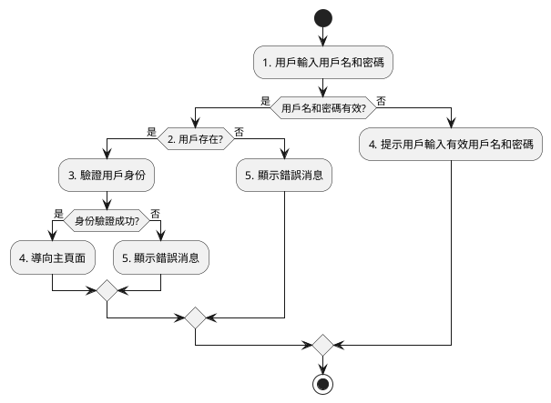

# 登入頁面規格書

- [登入頁面規格書](#登入頁面規格書)
  - [概述](#概述)
  - [功能](#功能)
  - [用戶界面](#用戶界面)
    - [登入表單](#登入表單)
  - [表單驗證](#表單驗證)
  - [登入檢核驗證條件](#登入檢核驗證條件)
  - [使用者互動](#使用者互動)
  - [設計示意圖 todo](#設計示意圖-todo)
  - [流程圖](#流程圖)
    - [流程說明](#流程說明)

---

## 概述

登入頁面是 MoneyMinder 軟體的入口之一，用戶可以通過該頁面輸入有效的用戶名和密碼來訪問其帳戶。

## 功能

- 提供用戶名和密碼輸入框。
- 提供登入按鈕，用戶可以點擊按鈕進行登入。
- 提供忘記密碼連結，用戶可以點擊連結以重置密碼。
- 提供註冊連結，用戶可以點擊連結進行新用戶註冊。

## 用戶界面

### 登入表單

- 用戶名欄位：用戶可以在這裡輸入他們的用戶名。
- 密碼欄位：用戶可以在這裡輸入他們的密碼。
- 登入按鈕：用戶可以點擊此按鈕進行登入操作。
- 忘記密碼連結：用戶可以點擊此連結以重置密碼。
- 註冊連結：用戶可以點擊此連結進行新用戶註冊。

## 表單驗證

- 用戶名驗證：
  - 必填欄位。
  - 最少 4 個字符。
  - 最多 20 個字符。
  - 只允許使用字母、數字和底線。
- 密碼驗證：
  - 必填欄位。
  - 最少 6 個字符。
  - 最多 20 個字符。
  - 包含至少一個大寫字母、一個小寫字母和一個數字。
  - 不允許使用特殊字符。

## 登入檢核驗證條件

- 用戶名和密碼都是必填欄位。
- 用戶名必須符合上述的用戶名驗證規則。
- 密碼必須符合上述的密碼驗證規則。

## 使用者互動

- 用戶可以使用 Tab 鍵在用戶名和密碼之間切換焦點。
- 當用戶輸入無效資訊時，系統應顯示相應的錯誤消息。

## 設計示意圖 todo

<!-- todo -->

## 流程圖

### 流程說明

1. 用戶名和密碼有效:用戶輸入用戶名和密碼。
2. 用戶存在:檢查用戶名和密碼是否有效。
3. 如果用戶名和密碼有效：
   - 檢查用戶是否存在。
   - 如果用戶存在：
     - 驗證用戶身份。
     - 如果身份驗證成功：
       - 導向主頁面。
      - 否則：
       - 顯示錯誤消息。
   - 否則：
     - 顯示錯誤消息。
4. 如果用戶名和密碼無效：

- 提示用戶輸入有效用戶名和密碼。
